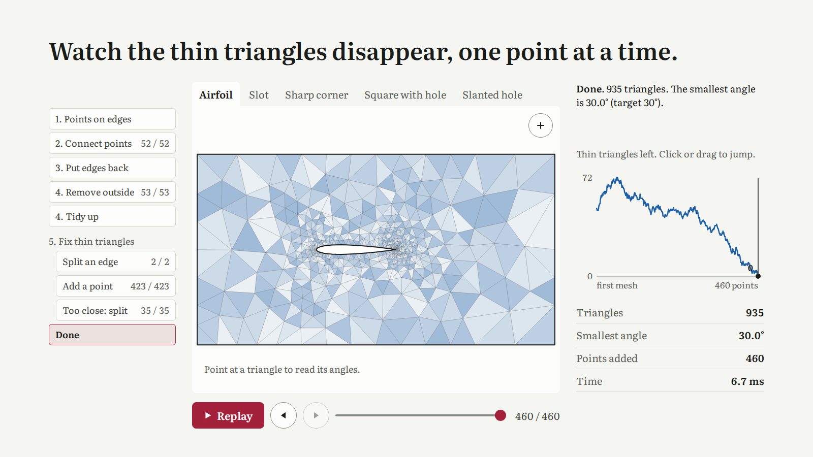
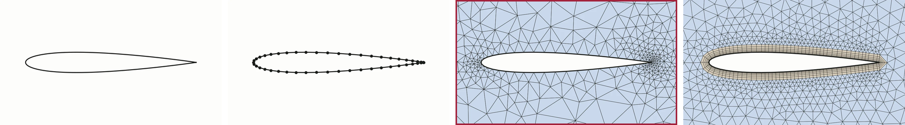
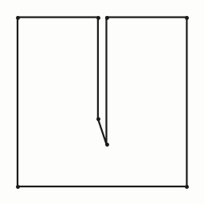
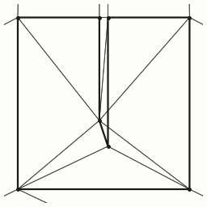
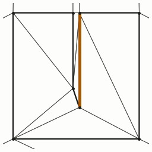
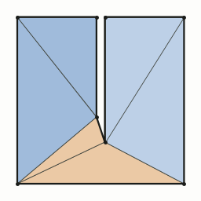
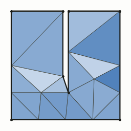

# cpp-mesher



A 2D triangle mesher I wrote in C++ to learn how meshing works.

**Interactive version:** [ru7herford.github.io/cpp-mesher](https://ru7herford.github.io/cpp-mesher/), which replays every point the mesher adds, and why.

## Where this fits



A real meshing process has four steps: a CAD shape, its edges divided into points, the area filled with triangles, and thin boundary layers at the walls. This project does the triangle step (outlined).

## How it works

| 1. Points on the edges | 2. Connect the points | 3. Put the edges back | 4. Remove the outside | 5. Fix thin triangles |
|---|---|---|---|---|
|  |  |  |  |  |

The input is a shape. The output is a triangle mesh with no angle below 30°, except next to input corners sharper than 60°. Thin triangles can make simulations inaccurate.

1. **Points on the edges.** The shape comes in as points; a curved edge must already be divided into points.
2. **Connect the points.** Add them one at a time, so that no point is inside the circumcircle of any triangle (Delaunay triangulation).
3. **Put the edges back.** Flip the triangles that cross a missing edge of the shape.
4. **Remove the outside.** Delete triangles outside the shape or in a hole.
5. **Fix thin triangles.** Add a point at the circumcentre of a thin triangle. If that point is too close to an edge of the shape (it encroaches on the edge), split that edge in two instead. Repeat until no triangle is thin (Ruppert's algorithm).

The two geometric tests ("which side of this line?", "inside this circle?") use exact arithmetic (Shewchuk's floating-point expansions), so rounding errors cannot make the mesh invalid. The input edges are straight lines: new points go on these straight segments, not on the original curve.

## Results

| Shape | Triangles | Smallest angle | Time (my laptop) |
|---|---:|---:|---:|
| Airfoil | 935 | 30.0° | 6.7 ms |
| Slot | 18 | 30.5° | 0.2 ms |
| Sharp corner | 264 | 10.0° (its own corner) | 2.1 ms |
| Square with hole | 321 | 30.1° | 2.6 ms |
| Slanted hole | 644 | 30.2° | 4.6 ms |

Checked with exact arithmetic (105,686 hard cases, 0 wrong), 312 random shapes, and against Jonathan Shewchuk's [Triangle](https://www.cs.cmu.edu/~quake/triangle.html), which reaches the same angles with fewer triangles.

## Run it

Needs GCC or Clang (C++20) and CMake.

```sh
cmake -S . -B build && cmake --build build -j && (cd build && ctest)
./build/mesher examples/airfoil.json mesh.vtk
```

An input is the shape's corners, any holes, and the angle target (`max_edge`, the longest edge allowed, is optional):

```json
{"outer": [[0, 0], [4, 0], [4, 4], [0, 4]],
 "holes": [[[1.5, 1.5], [2.5, 1.5], [2.5, 2.5], [1.5, 2.5]]],
 "min_angle_deg": 30, "max_edge": 0.5}
```

## Code

- `src/cdt2d.cpp`: steps 2 to 4.
- `src/refine.cpp`: steps 1 and 5.
- `src/predicates.cpp`: the exact tests.
- `scripts/`: the page data, the pictures, and the comparison with Triangle.

The comments in each file explain how it works.

## Sources

[Delaunay (1934)](https://www.mathnet.ru/eng/im4937), [Bowyer (1981)](https://doi.org/10.1093/comjnl/24.2.162), [Watson (1981)](https://doi.org/10.1093/comjnl/24.2.167), [Sloan (1993)](https://doi.org/10.1016/0045-7949(93)90239-A), [Ruppert (1995)](https://doi.org/10.1006/jagm.1995.1021), [Shewchuk (1997)](https://doi.org/10.1007/PL00009321), [Shewchuk (2002)](https://doi.org/10.1016/S0925-7721(01)00047-5). The thin-layer picture is drawn with [gmsh](https://gmsh.info) ([Geuzaine and Remacle, 2009](https://doi.org/10.1002/nme.2579)).

MIT licence.
